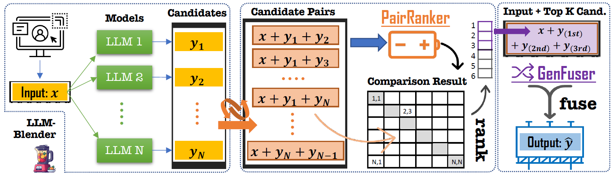

# 🔥 Automatic Pairwise-Ranking Evaluator (PairRM) || Modified to Run on Mac Chips ;>
- Code & Model borrowed from: https://github.com/yuchenlin/LLM-Blender


## Overview




## Usage

### Installation

```bash
git clone https://github.com/fangyuan-ksgk/PairRM-with-mps
cd PairRM-with-mps
pip install -e .
```
Then you are good to go through our PairRM-with-mps with `import llm_blender_mps`.

### Use case 1: (Re-)Ranking model outputs by pairwise comparisons


```python
import llm_blender_mps as llm_blender
blender = llm_blender.Blender()
blender.loadranker("llm-blender/PairRM", device="mps") # load ranker checkpoint
```

- Then you can rank with the following function

```python
inputs = ["hello, how are you!", "I love you!"]
candidates_texts = [["get out!", "hi! I am fine, thanks!", "bye!"], 
                    ["I love you too!", "I hate you!", "Thanks! You're a good guy!"]]
ranks = blender.rank(inputs, candidates_texts, return_scores=False, batch_size=1)
# ranks is a list of ranks where ranks[i][j] represents the ranks of candidate-j for input-i
"""
ranks -->
array([[3, 1, 2], # it means "hi! I am fine, thanks!" ranks the 1st, "bye" ranks the 2nd, and "get out!" ranks the 3rd. 
       [1, 3, 2]], # it means "I love you too"! ranks the the 1st, and "I hate you!" ranks the 3rd.
       dtype=int32) 

"""
```

TBD: port the training script to run on MPS as well.


